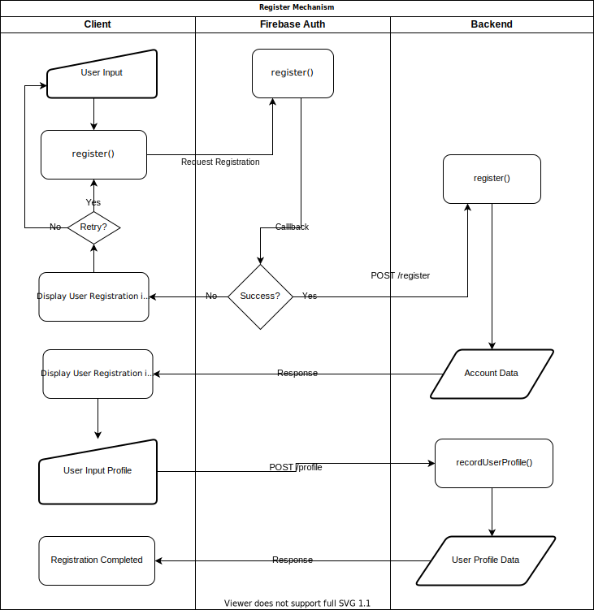
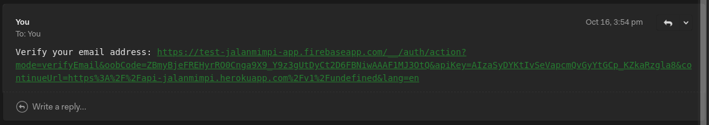
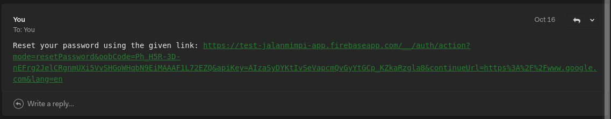

# Account API
Use this API for any account management purpose. This API required an authorization token, thus only use this API with authorized access.


### Register User Account

##### Flowchart


##### Description
This API will register the user to the database **after** the registration process using Firebase Client SDK is completed or succeeded. Thus please make sure that the registration process is completed or succeeded before calling this API.

##### HTTP Request Endpoint
> `POST` `ROOT_ENDPOINT/account/register`

##### HTTP Request Header

|Field |Value  |Description  |
|---------|---------|---------|
|authorization     |`STRING` Bearer ${TOKEN_ID}         | Firebase Token ID.         |

##### HTTP Response
```json
{
    "id": 5,
    "uid": "YSrOtatKoaYAUz1jwV6DdLrhUVC3",
    "join_date": "2020-10-18T03:22:55.562Z",
    "email_verified": false,
    "profile_is_filled": false
}
```

### Get User Account Info
##### Description
This API retrieve the account info of user.

##### HTTP Request Endpoint
>`GET` `ROOT_ENDPOINT/v1/account`

##### HTTP Request Header

|Field |Value  |Description  |
|---------|---------|---------|
|authorization     |`STRING` Bearer ${TOKEN_ID}         | Firebase Token ID.         |

###### HTTP Response
```json
{
    "uid": "YSrOtatKoaYAUz1jwV6DdLrhUVC3",
    "join_date": "2020-10-17T09:07:48.515Z",
    "email_verified": false,
    "profile_is_filled": true
}
```
### Record User Profile
##### Description
This API will record user profile data passed in the HTTP request body.

##### HTTP Request Endpoint
>`POST` `ROOT_ENDPOINT/account/profile`

##### HTTP Request Header
|Field |Value  |Description  |
|---------|---------|---------|
|Content-type     |application/json         | `REQUIRED` Content type.        |
|authorization     |`STRING` Bearer ${TOKEN_ID}         | `REQUIRED`Firebase Token ID.         |

##### HTTP Request Body

|Field    |Value  |Description  |
|---------|---------|---------|
|firstName     |`STRING`         |         |
|lastName     | `STRING`        |         |
|email     | `STRING`        | `REQUIRED` `UNIQUE` Please validate the email to ensure it is a valid email.       |
|gender     | `Male` or `Female`        | There are only two values, `Male` or `Female`, otherwise return error       |
|profession     | `STRING`        |         |
|phoneNumber    | `STRING`        |         |
|photoUrl     | `STRING`        |         |
|idCardUrl     | `STRING`        |         |
|addressLine1     | `STRING`        |         |
|addressLine2     | `STRING`        |         |
|city     | `STRING`        |   `REQUIRED`      |
|province     | `STRING`        |      `REQUIRED`   |
|country     | `STRING`        |   `REQUIRED`      |
|postalCode     | `INTEGER`        | `REQUIRED`        |

```json
{
    "firstName": "John",
    "lastName": "Doe",
    "email": "john@dow.com",
    "gender": "Male",
    "profession": "",
    "phoneNumber": "0866666666",
    "photoUrl": "",
    "idCardUrl": "",
    "addressLine1": "",
    "addressLine2": "",
    "city": "Jakarta",
    "province": "DKI Jakarta",
    "country": "Indonesia",
    "postalCode": 16400
}
```

##### HTTP Response
```json
{
    "uid": "YSrOtatKoaYAUz1jwV6DdLrhUVC3",
    "first_name": "John",
    "last_name": "Doe",
    "email": "john@dow.com",
    "email_verified": false,
    "gender": "Male",
    "profession": "",
    "phone_number": "0866666666",
    "photo_url": "",
    "id_card_url": "",
    "address_line_1": "",
    "address_line_2": "",
    "postal_code": 16400,
    "city": "Jakarta",
    "province": "DKI Jakarta",
    "country": "Indonesia",
    "join_date": "2020-10-18T03:20:46.860Z"
}
```

### Get User Profile
##### Description
This API will retrieve user profile data from the database. This API utilizes Firebase Token ID as a unique identifier for each user.

##### HTTP Request Endpoint
>`GET` `ROOT_ENDPOINT/account/profile`
##### HTTP Request Header
|Field |Value  |Description  |
|---------|---------|---------|
|authorization    |`STRING` Bearer ${TOKEN_ID}        | `REQUIRED` Firebase Token ID.        |
##### HTTP Response
```json
{
    "uid": "YSrOtatKoaYAUz1jwV6DdLrhUVC3",
    "first_name": "John",
    "last_name": "Doe",
    "email": "john@dow.com",
    "email_verified": false,
    "gender": "Male",
    "profession": "",
    "phone_number": "0866666666",
    "photo_url": "",
    "id_card_url": "",
    "address_line_1": "",
    "address_line_2": "",
    "postal_code": 16400,
    "city": "Jakarta",
    "province": "DKI Jakarta",
    "country": "Indonesia",
    "join_date": "2020-10-18T03:20:46.860Z"

}
```

### Update User Profile
##### Descriprion
Use this for updating a user profile data.
##### HTTP Request Endpoint
>`PUT` `ROOT_ENDPOINT/account/profile`
##### HTTP Request Header
|Field |Value  |Description  |
|---------|---------|---------|
|Content-type     |application/json         | `REQUIRED` Content type.        |
|authorization     |`STRING` Bearer ${TOKEN_ID}         | `REQUIRED`Firebase Token ID.         |

##### HTTP Request Body

|Field    |Value  |Description  |
|---------|---------|---------|
|firstName     |`STRING`         |         |
|lastName     | `STRING`        |         |
|email     | `STRING`        | `REQUIRED` `UNIQUE` Please validate the email to ensure it is a valid email.       |
|gender     | `Male` or `Female`        | There are only two values, `Male` or `Female`, otherwise return error       |
|profession     | `STRING`        |         |
|phoneNumber    | `STRING`        |         |
|photoUrl     | `STRING`        |         |
|idCardUrl     | `STRING`        |         |
|addressLine1     | `STRING`        |         |
|addressLine2     | `STRING`        |         |
|city     | `STRING`        |   `REQUIRED`      |
|province     | `STRING`        |      `REQUIRED`   |
|country     | `STRING`        |   `REQUIRED`      |
|postalCode     | `INTEGER`        | `REQUIRED`        |

```json
{
    "firstName": "John Don",
    "lastName": "Doe",
    "email": "john@dow.com",
    "gender": "Male",
    "profession": "",
    "phoneNumber": "0866666666",
    "photoUrl": "",
    "idCardUrl": "",
    "addressLine1": "",
    "addressLine2": "",
    "city": "Jakarta",
    "province": "DKI Jakarta",
    "country": "Indonesia",
    "postalCode": 16400
}
```

##### HTTP Response
```json
{
    "uid": "YSrOtatKoaYAUz1jwV6DdLrhUVC3",
    "first_name": "John Don",
    "last_name": "Doe",
    "email": "john@dow.com",
    "email_verified": false,
    "gender": "Male",
    "profession": "",
    "phone_number": "0866666666",
    "photo_url": "",
    "id_card_url": "",
    "address_line_1": "",
    "address_line_2": "",
    "postal_code": 16400,
    "city": "Jakarta",
    "province": "DKI Jakarta",
    "country": "Indonesia",
    "join_date": "2020-10-18T03:20:46.860Z"
}
```

### Request Email Verification
Use this API for requesting a new email verification.

##### HTTP Request Endpoint
>`GET` `ROOT_ENDPOINT/account/email/verify`
##### HTTP Request Header
|Field |Value  |Description  |
|---------|---------|---------|
|authorization     |`STRING` Bearer ${TOKEN_ID}         | `REQUIRED`Firebase Token ID.         |

##### HTTP Response
```json
{
    "accepted": [
        "john@dow.com"
    ],
    "rejected": [],
    "envelopeTime": 1114,
    "messageTime": 930,
    "messageSize": 593,
    "response": "250 2.0.0 OK  1603004340 n15sm8196286pgt.75 - gsmtp",
    "envelope": {
        "from": "verify@jalanmimpi.id",
        "to": [
            "john@dow.com"
        ]
    },
    "messageId": "<D90b507a-d1cb-2578-6552-db612c5f3129@gmail.com>"
}
```

##### E-mail message sent to the recipient


### Request Reset Password
##### Description
Use this API for requesting a reset password e-mail message.

##### HTTP Request Endpoint
>`GET` `ROOT_ENDPOINT/account/resetPassword`

##### HTTP Request Params
|Field |Value  |Description  |
|---------|---------|---------|
|email     |`STRING`          | `REQUIRED` User registered email.         |

- ###### Example
`GET` `https://api-jalanmimpi.herokuapp.com/v1/account/resetPassword?email=john@dow.com`

##### HTTP Response
```json
{
    "accepted": [
        "john@dow.com"
    ],
    "rejected": [],
    "envelopeTime": 1114,
    "messageTime": 930,
    "messageSize": 593,
    "response": "250 2.0.0 OK  1603004340 n15sm8196286pgt.75 - gsmtp",
    "envelope": {
        "from": "verify@jalanmimpi.id",
        "to": [
            "john@dow.com"
        ]
    },
    "messageId": "<D90b507a-d1cb-2578-6552-db612c5f3129@gmail.com>"
}
```

##### E-mail message sent to the recipient



### Register Bank Account
##### Description
This API will record the provided bank account data.
##### HTTTP Request Endpoint
>`POST` `ROOT_ENDPOINT/account/bank-account/register

##### HTTP Request Header
|Field |Value  |Description  |
|---------|---------|---------|
|Content-type    |application/json         | `REQUIRED` Define the content type        |
|authorization     |`STRING` Bearer ${TOKEN_ID}         | `REQUIRED`Firebase Token ID.         |

##### HTTP Request Body

|Field  |Value  |Description  |
|---------|---------|---------|
|bankName     | `STRING`        |`REQUIRED`         |
|accountNumber     |`INTEGER`         |`REQUIRED` 
|description     |`TEXT`         | `OPTIONAL`        |

```json
{
    "bankName": "Bank Mandiri",
    "accountNumber": "102997729100",
    "description": "My Personal Account"
}
```

##### HTTP Response
```json
{
    "id": 1,
    "uid": "YSrOtatKoaYAUz1jwV6DdLrhUVC3",
    "bank_name": "Bank Mandiri",
    "account_number": "102997729100",
    "description": "My Personal Account",
    "created_date": "2020-10-18T07:39:22.843Z"
}
```

### Get User Bank Account
##### Description
This will retrieve user bank account data from the database based on the provided Firebase Token ID.

##### HTTP Request Endpoint
>`GET` `ROOT_ENDPOINT/account/bank-account`


##### HTTP Request Header
|Field |Value  |Description  |
|---------|---------|---------|
|authorization     |`STRING` Bearer ${TOKEN_ID}         | `REQUIRED`Firebase Token ID.         |

##### HTTP Response
```json
[
    {
        "bank_account_id": 1,
        "uid": "YSrOtatKoaYAUz1jwV6DdLrhUVC3",
        "name": "John Don Dow",
        "email": "john@dow.com",
        "bank_name": "Bank Mandiri",
        "account_number": "102997729100",
        "description": "My Personal Account",
        "created_date": "2020-10-18T07:39:22.843Z"
    }
]
```

### Update User Bank Account
##### Description
Use this API for updating a registered bank account data.

##### HTTP Request Endpoint
>`PUT` `ROOT_ENDPOINT/account/bank-account`


##### HTTP Request Header
|Field |Value  |Description  |
|---------|---------|---------|
|Content-type    |application/json         | `REQUIRED` Define the content type        |
|authorization     |`STRING` Bearer ${TOKEN_ID}         | `REQUIRED`Firebase Token ID.         |

##### HTTP Request Body

|Field  |Value  |Description  |
|---------|---------|---------|
|bankAccountId     | `INTEGER`        |`REQUIRED` `UNIQUE`        |
|bankName     | `STRING`        |`REQUIRED`         |
|accountNumber     |`INTEGER`         |`REQUIRED`     |
|description     |`TEXT`         | `OPTIONAL`        |

```json
{
    "bankAccountId": 1,
    "bankName": "Bank BNI",
    "accountNumber": "102997729100",
    "description": "My Personal Account Edited"
}
```

##### HTTP Response
```json
{
    "id": 1,
    "uid": "YSrOtatKoaYAUz1jwV6DdLrhUVC3",
    "bank_name": "Bank BNI",
    "account_number": "102997729100",
    "description": "My Personal Account Edited",
    "created_date": "2020-10-18T07:39:22.843Z"
}
```