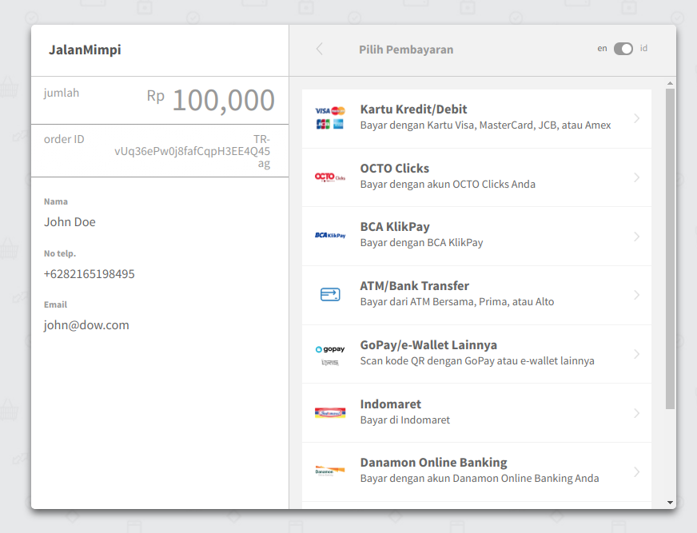

# Payment API

### Create Payment

##### Description

This API will record the transaction data and request a payment token or redirect link from Midtrans API. Use this token to show the Snap API payment popup windows provided by Midtrans or instead use the link to redirect user to the payment page.

##### HTTP Request Endpoint

> `POST` `ROOT_ENDPOINT/payment`

##### HTTP Request Header

| Field         | Value                        | Description                  |
| ------------- | ---------------------------- | ---------------------------- |
| Content-type  | application/json             | `REQUIRED` Content type.     |
| authorization | `STRING` Bearer \${TOKEN_ID} | `REQUIRED`Firebase Token ID. |

##### HTTP Request Body

| Field       | Value     | Description |
| ----------- | --------- | ----------- |
| donationId  | `STRING`  | `REQUIRED`  |
| nominal     | `INTEGER` | `REQUIRED`  |
| description | `TEXT`    | `OPTIONAL`  |

```json
{
  "donationId": "ypI4SjK8KE5Mlx4kqfZB6H6Hx",
  "nominal": "100000",
  "description": "Semangat"
}
```

##### HTTP Response

```json
{
  "id": 23,
  "transaction_id": "TR-vUq36ePw0j8fafCqpH3EE4Q45ag",
  "uid": "YSrOtatKoaYAUz1jwV6DdLrhUVC3",
  "donation_id": "DN-ypI4SjK8KE5Mlx4kqfZB6H6Hx",
  "nominal": 100000,
  "status": "Pending",
  "date": "2020-10-20T09:59:44.072Z",
  "description": "Semangat",
  "payment_data": {
    "token": "c6760d72-dfd2-4b3f-a471-4eec30694365",
    "redirect_url": "https://app.sandbox.midtrans.com/snap/v2/vtweb/c6760d72-dfd2-4b3f-a471-4eec30694365"
  }
}
```

- Screenshoot of the redirect link to the payment page</br></br>
  

### Get Payment Info

##### Description

Retrieve the payment info from database.

##### HTTP Request Endpoint

> `GET` `ROOT_ENDPOINT/payment`

##### HTTP Request Header

| Field         | Value                        | Description                  |
| ------------- | ---------------------------- | ---------------------------- |
| authorization | `STRING` Bearer \${TOKEN_ID} | `REQUIRED`Firebase Token ID. |

##### HTTP Request Query String

| Field         | Value    | Description |
| ------------- | -------- | ----------- |
| transactionId | `STRING` | `REQUIRED`  |

- Example
  - `GET` `https://api-jalanmimpi.herokuapp.com/v1/payment?transactionId=TR-vUq36ePw0j8fafCqpH3EE4Q45ag`

##### HTTP Response

```json
{
  "id": 23,
  "transaction_id": "TR-vUq36ePw0j8fafCqpH3EE4Q45ag",
  "uid": "v6LIjt3RaqiAFzJvJkRVT9ZcP",
  "donation_id": "DN-ypI4SjK8KE5Mlx4kqfZB6H6Hx",
  "nominal": 100000,
  "status": "Success",
  "date": "2020-10-20T10:28:49.823Z",
  "description": "Semangat"
}
```

### Get Payment Status

##### HTTP Request Endpoint

> `GET` `ROOT_ENDPOINT/payment/status`

##### HTTP Request Header

| Field         | Value                        | Description                  |
| ------------- | ---------------------------- | ---------------------------- |
| authorization | `STRING` Bearer \${TOKEN_ID} | `REQUIRED`Firebase Token ID. |

##### HTTP Request Query String

| Field         | Value    | Description |
| ------------- | -------- | ----------- |
| transactionId | `STRING` | `REQUIRED`  |

- Example
  - `GET` `https://api-jalanmimpi.herokuapp.com/v1/payment/status?transactionId=TR-vUq36ePw0j8fafCqpH3EE4Q45ag`

##### HTTP Response

```json
{
  "transaction_id": "TR-vUq36ePw0j8fafCqpH3EE4Q45ag",
  "status": "Success"
}
```

### Get List of Transactions By User UID

##### Description

Get a list of payment info based on user uid.

##### HTTP Request Endpoint

> `GET` `ROOT_ENDPOINT/payment/list/user`

##### HTTP Request Header

| Field         | Value                        | Description                  |
| ------------- | ---------------------------- | ---------------------------- |
| authorization | `STRING` Bearer \${TOKEN_ID} | `REQUIRED`Firebase Token ID. |

##### HTTP Response

```json
[
  {
    "transaction_id": "TR-LEvzIZlANjtsuFOOpsg6iaa7MHz",
    "uid": "v6LIjt3RaqiAFzJvJkRVT9ZcP",
    "donation_id": "ypI4SjK8KE5Mlx4kqfZB6H6Hx",
    "nominal": "Bantu Saya Skripsi 2020",
    "description": "Semangat",
    "date": "2020-10-20T09:57:27.923Z",
    "status": "Pending"
  },
  {
    "transaction_id": "TR-XEEqgC3Y14Pn6qj9Bq4J2jX5Q4e",
    "uid": "v6LIjt3RaqiAFzJvJkRVT9ZcP",
    "donation_id": "ypI4SjK8KE5Mlx4kqfZB6H6Hx",
    "nominal": "Bantu Saya Skripsi 2020",
    "description": "Semangat",
    "date": "2020-10-20T09:59:31.339Z",
    "status": "Pending"
  },
  {
    "transaction_id": "TR-vUq36ePw0j8fafCqpH3EE4Q45ag",
    "uid": "v6LIjt3RaqiAFzJvJkRVT9ZcP",
    "donation_id": "ypI4SjK8KE5Mlx4kqfZB6H6Hx",
    "nominal": "Bantu Saya Skripsi 2020",
    "description": "Semangat",
    "date": "2020-10-20T10:28:49.823Z",
    "status": "Success"
  }
]
```

### Get List of Transactions By Donation ID

##### Description

Get all transaction based on donation ID. Only retrieve a transaction with `Success` status.

##### HTTP Request Endpoint

> `GET` `ROOT_ENDPOINT/payment/list/donation`

##### HTTP Request Header

| Field         | Value                        | Description                  |
| ------------- | ---------------------------- | ---------------------------- |
| authorization | `STRING` Bearer \${TOKEN_ID} | `REQUIRED`Firebase Token ID. |

##### HTTP Request Query String

| Field      | Value    | Description |
| ---------- | -------- | ----------- |
| donationId | `STRING` | `REQUIRED`  |

- Example
  - `GET` `https://api-jalanmimpi.herokuapp.com/v1/payment/list/donation?donationId=ypI4SjK8KE5Mlx4kqfZB6H6Hx`

##### HTTP Response

```json
[
  {
    "transaction_id": "TR-vUq36ePw0j8fafCqpH3EE4Q45ag",
    "uid": "B234",
    "name": "John Doe",
    "email": "john@dow.com",
    "donation_id": "ypI4SjK8KE5Mlx4kqfZB6H6Hx",
    "nominal": 100000,
    "description": "Semangat",
    "date": "2020-10-20T10:28:49.823Z",
    "status": "Success"
  }
]
```
